# Сценарии использования модуля наполнения корпуса

## Сценарий 1. Авторизация пользователя
* открытие формы авторизации
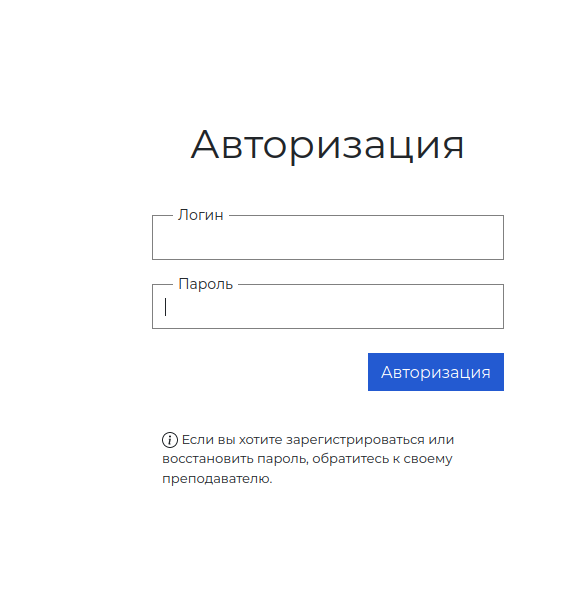
* ввод учетных данных пользователя
* успешная авторизация с переходом на страницу списка языков
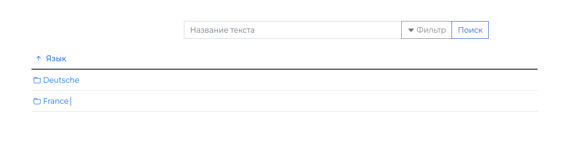

## Сценарий 2. Регистрация студента
* авторизация пользователя
* переход на страницу управления
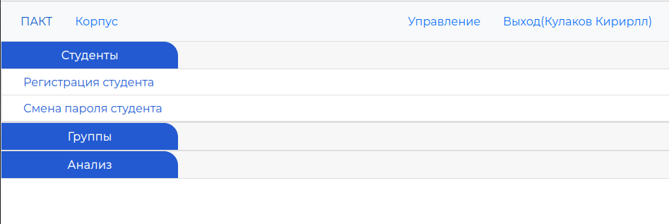
* открытие формы регистрации студента
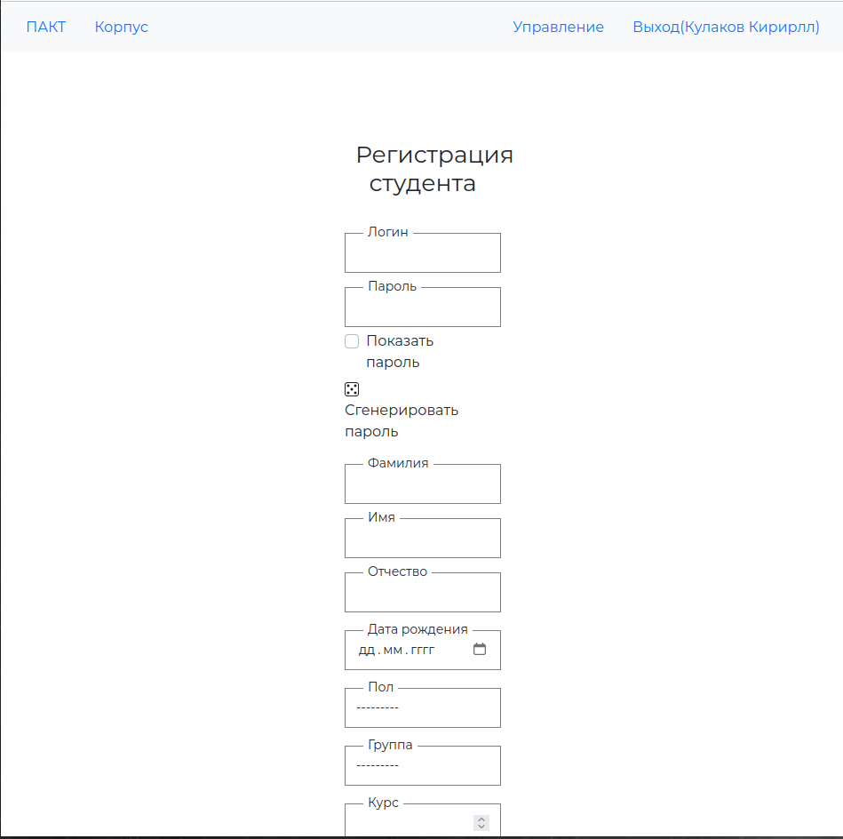
* ввод данных (логин, пароль, фамилия, имя, отчество, дата рождения, пол, группа, курс)
* успешная регистрация студента с переходом на страницу списка языков
## Сценарий 3. Смена пароля студента
* авторизация пользователя
* переход на страницу управления
* выбор студента и указание нового пароля
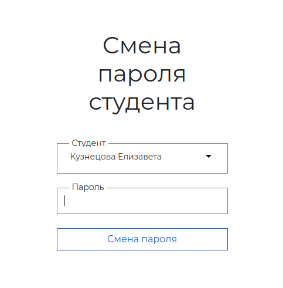
* успешная смена пароля студента с переходом на страницу управления
## Сценарий 4. Создание группы
* авторизация пользователя
* переход на страницу управления
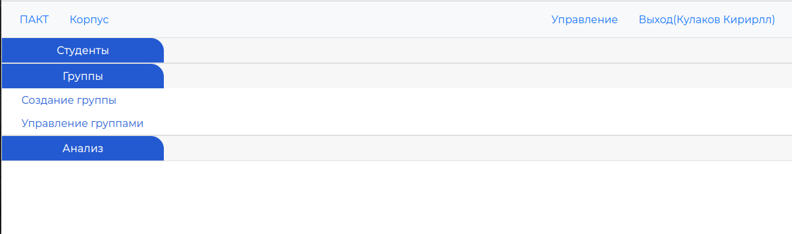
* открытие формы создания группы
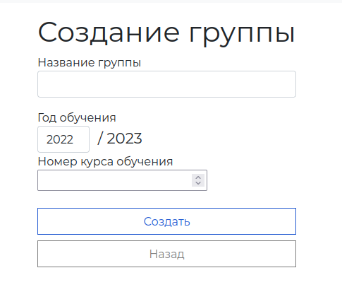
* ввод данных (название, год, номер курса)
* успешное создание группы с выводом соответствующего уведомления
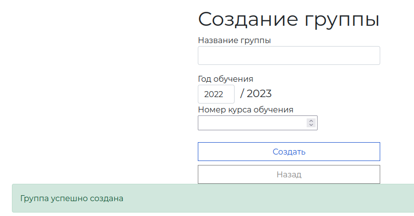
## Сценарий 5. Управление группой
* авторизация пользователя
* переход на страницу управления
* открытие формы управления группами
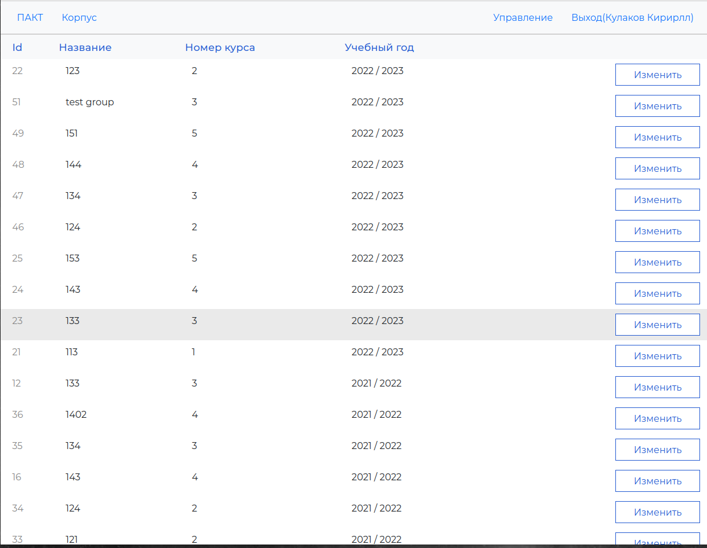
* выбор группы для изменения данных
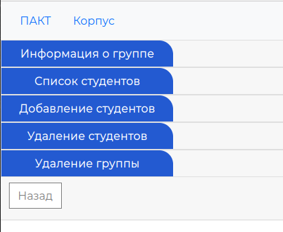
* ввод новых данных о группе или просмотр списка студентов в группе или добавление студентов в группу или удаление студентов из группы
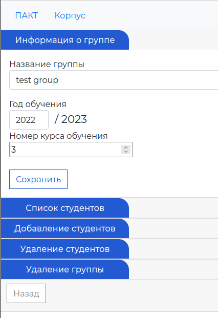
* переход на страницу управления группой
## Сценарий 6. Добавление работы студента
* авторизация пользователя
* выбор языка текста
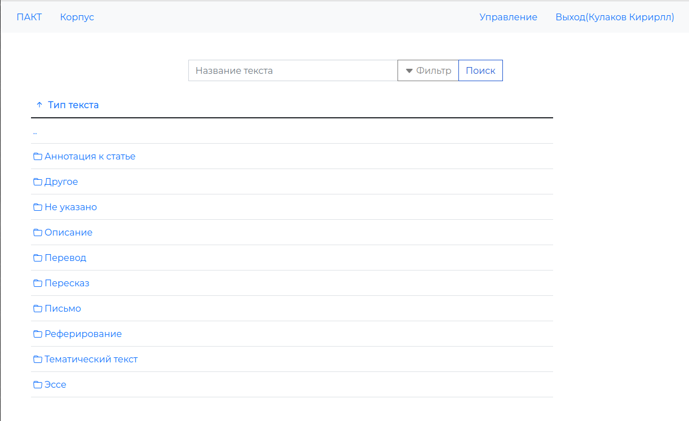
* выбор тематики текста
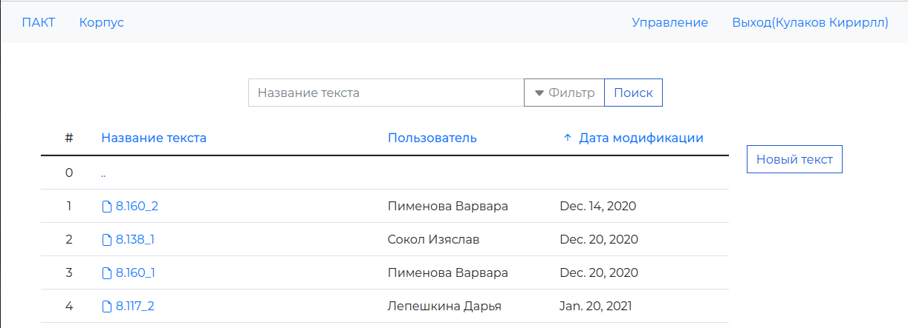
* переход на форму загрузки текста

* ввод данных о тексте (название, текст, дата создания, место написания текста, год изучения языка, эмоционально-физиологическое состояние, оценка задания, самооценивание)
* успешное сохранение текста и переход на форму списка текстов заданной тематики
## Сценарий 7. Разметка ошибок в работе студента
* авторизация пользователя
* выбор языка текста
* выбор тематики текста
* выбор текста
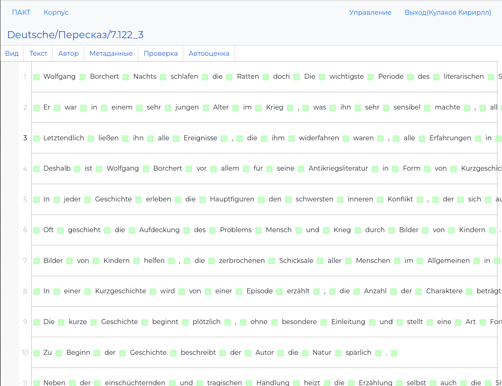
* для каждой найденной ошибки: выбор слова или группы слов, установка отметки ошибки и степени грубости
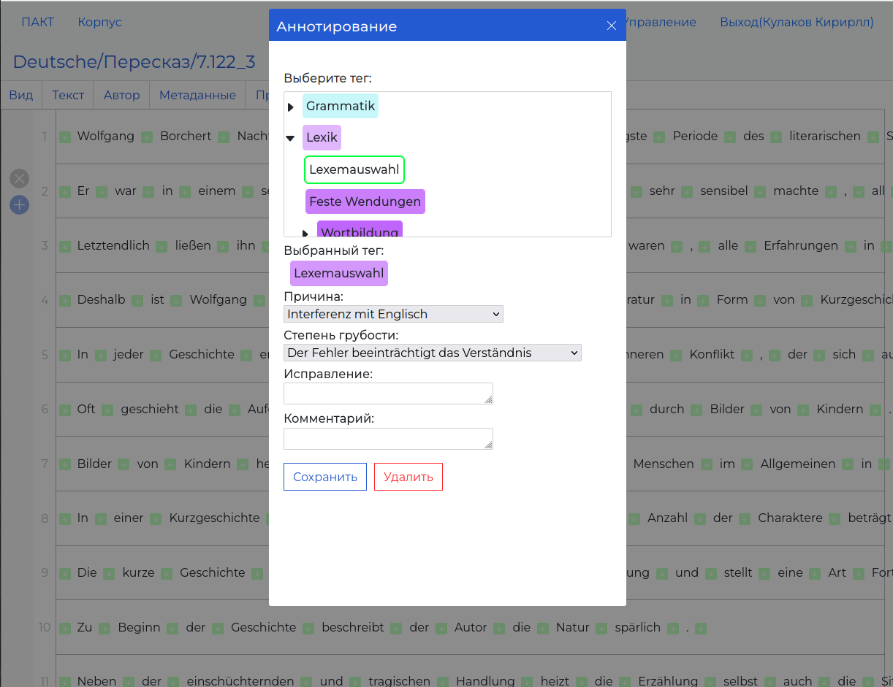
* открытие формы установки результатов проверки
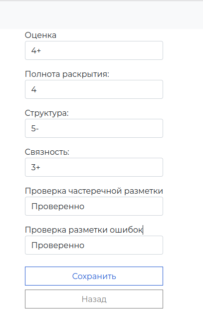
* отметка успешности проверки текста и расстановка оценок
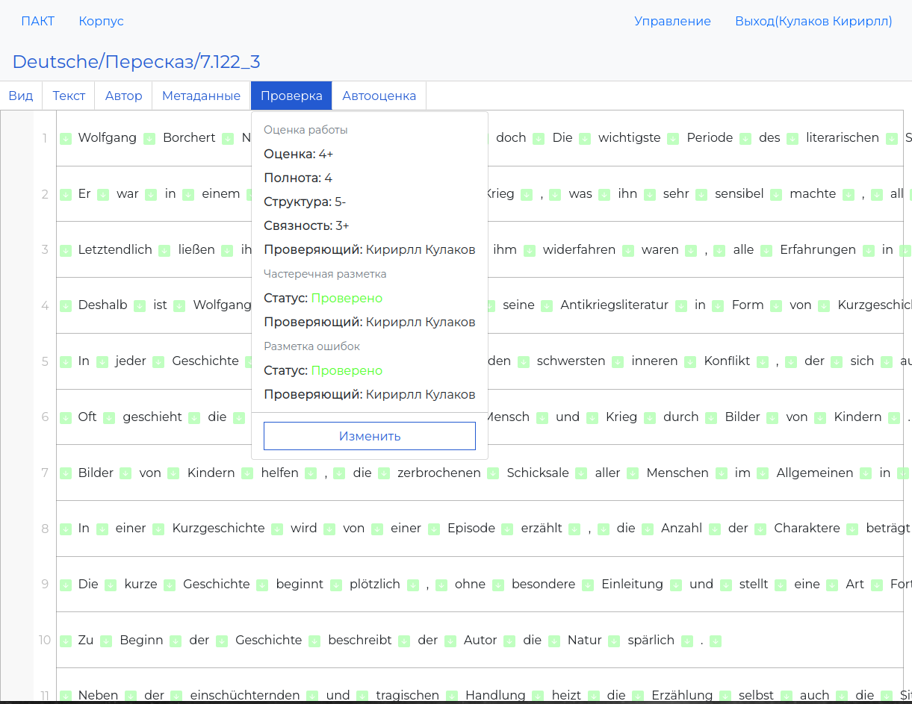
* успешное сохранение размеченных ошибок

